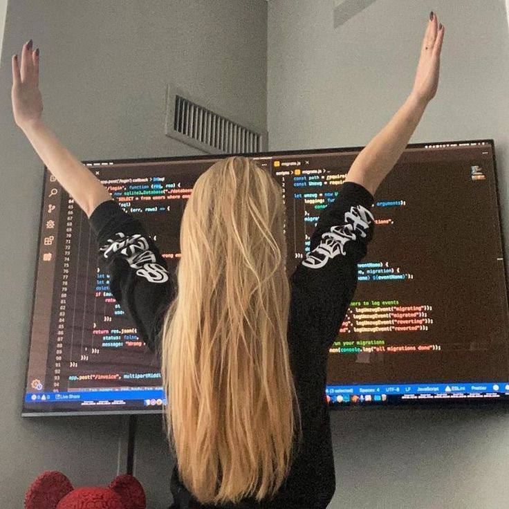

  

<h1 align="center">Hi 👋, I'm Qu1nel</h1>

[][telegram]
[][github]
[][codewars]

### **Information**

- 🤍 I’m currently working on **..**
- 🖤 I’m currently **learning everything**
- 🤍 Fun fact: **I confuse left and right side**

⌚ _I’m currently working on this page._

##### Contact email: **covach.qn@gmail.com**

<h3> <b>Languages and tools:</b></h3>

  
  
  
  
  
  
  
  

## 🚀 **GitHub Stats:**

<picture>
<source 
  srcset="https://github-readme-stats.vercel.app/api?username=Qu1nel&count_private=true&show_icons=true&theme=react"
  media="(prefers-color-scheme: dark)"
/>
<source
  srcset="https://github-readme-stats.vercel.app/api?username=Qu1nel&count_private=true&show_icons=true&theme=graywhite"
  media="(prefers-color-scheme: light), (prefers-color-scheme: no-preference)"
/>

</picture>
 
<picture>
<source
  srcset="https://github-readme-stats.vercel.app/api/top-langs/?username=Qu1nel&layout=compact&theme=react"
  media="(prefers-color-scheme: dark)"
/>
<source
  srcset="https://github-readme-stats.vercel.app/api/top-langs/?username=Qu1nel&layout=compact&theme=graywhite"
  media="(prefers-color-scheme: light), (prefers-color-scheme: no-preference)"
/>

</picture>
  

 

---

[][github]

[Codewars]: https://www.codewars.com/users/Qu1nel
[Telegram]: https://t.me/qnllqq
[Github]: https://github.com/Qu1nel
