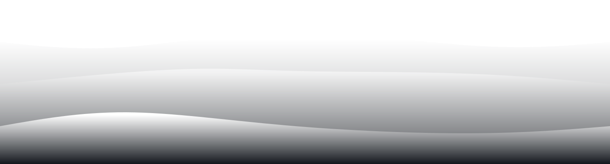
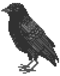

  <ul>
    

    <h1 style="display: inline-block;">
    <samp>&gt; Hey There! I'm Qu1nel</samp>
    </h1>
    

  </ul>
  <samp>
    「 I'm a self-taught. 」 
    「 The credo in life is eternal beginner in everything. 」 
    「 I'm someone who is passionate about GNU/Linux and likes freedom, rice, write code and freedom. 」 
    <h2></h2>
  </samp>

  <samp>
    Purposeful self-taught programmer with a good low-level understanding of hardware and an equally strong understanding of the software development lifecycle.
    Interested more in Computer Science than Web, so inclined to learn fundamental things in programming than learning the 100th framework that will join the list of obsolete ones anyway..
  </samp>
   
  <samp>
    Better to spend time on linear algebra, at least you can be a bit more unique with it :3
  </samp>

 

<h2><samp>&gt; Tech Stack:</samp></h2>

  
   
  
  
  
  
  
  
  
  
  
  
  
  
  
  
  
  
  
  
  
  
  
  
  
  

<h2><samp>&gt; Stats:</samp></h2>

  
  

  
<samp>&#9776; More</samp>

  

    <a href="https://metrics.lecoq.io/Qu1nel?template=classic&isocalendar=1&isocalendar.duration=full-year"><i><b>Metrics</b></i></a>
     
    
    
  </dib>
   
  
  

    
<samp>&#9776; Top Languages (time)</samp>

    
  

  

 

<h2><samp>&gt; Contact info:</samp></h2>

  
  
  
  

