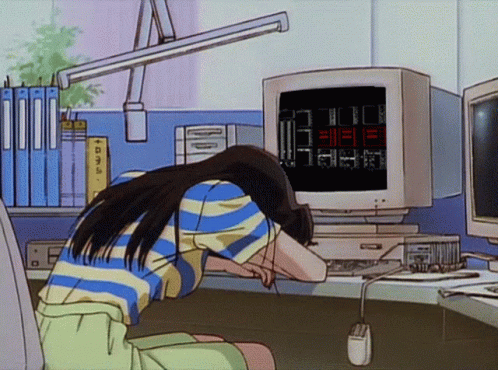

<h2 align="center">Hi there, I'm Ivan - aka Qu1nel 👋</h2>

  
  
  
  

  

<ul>
  
  <h3>Information</h3>
  
   
  <li>🤍 I’m currently working on <a href="#" ><b>...</b></a></li> 
  <li>❤️ I’m currently learning <b>assembly, make</b></li> 
  <li>🤍 A passionate Self-taught developer</li> 
  <li>❤️ Fun fact: <b>I confuse left and right side</b></li> 
  <li>
 🤍 <i>I’m currently working on this page.</i>  
</li>
</ul>

   

  <h3>Languages and tools</h3>
  
  
  

 

<h2>
   <b>Statistics</b>
</h2>

 
  
<b>💻 GitHub Profile Statistics</b>

  

     
    
    
  

   
  

  
  
  
    
  
 

