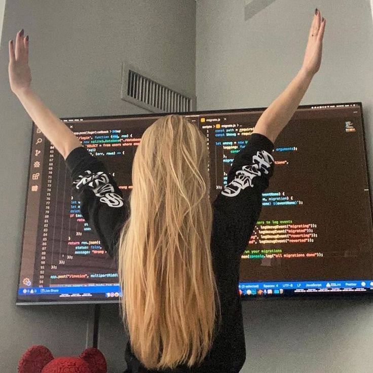

  

<h1 align="center">Hi, I'm Qu1nel 👋</h1>

[][telegram]
[][gmail]
[][github]
[][codewars]

 

  

  <ul>
    
<h1 style="display: inline-block;"> Information</h1>

  </ul>
  
  

   
  
  <ul>
  <li>🤍 I’m currently working on <b>..</b></li> 

  <li>🖤 I’m currently <b>learning everything</b></li> 

  <li>🤍 A passionate Self-taught developer</li> 

  <li>🖤 Fun fact: <b>I confuse left and right side</b></li> 
  </ul>

 

  

  <ul>
    
<h2 style="display: inline-block;"> <b>Languages and tools:</b></h2>

  </ul>
  

  

  
  
  
  
  
  
  
    
  

 

<h2> <b>Statistics:</b></h2>

 
  
<b>💻 GitHub Profile Statistics</b>

  

   
<picture>
<source 
  srcset="https://github-readme-stats.vercel.app/api?username=Qu1nel&count_private=true&show_icons=true&theme=react"
  media="(prefers-color-scheme: dark)"
/>
<source
  srcset="https://github-readme-stats.vercel.app/api?username=Qu1nel&count_private=true&show_icons=true&theme=graywhite"
  media="(prefers-color-scheme: light), (prefers-color-scheme: no-preference)"
/>

</picture>
 
<picture>
<source
  srcset="https://github-readme-stats.vercel.app/api/top-langs/?username=Qu1nel&layout=compact&theme=react"
  media="(prefers-color-scheme: dark)"
/>
<source
  srcset="https://github-readme-stats.vercel.app/api/top-langs/?username=Qu1nel&layout=compact&theme=graywhite"
  media="(prefers-color-scheme: light), (prefers-color-scheme: no-preference)"
/>

</picture>

 

----

 

[][github]

 ⌚ <i>I’m currently working on this page.</i>  

[Codewars]: https://www.codewars.com/users/Qu1nel
[Telegram]: https://t.me/qnllqq
[Github]: https://github.com/Qu1nel
[Gmail]: covach.qn@gmail.com
